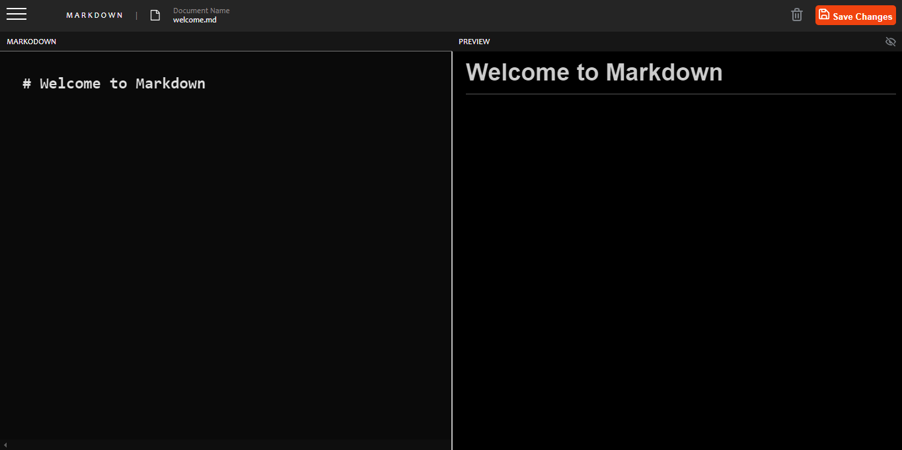

# Frontend Mentor - In-browser markdown editor solution

This is a solution to the [In-browser markdown editor challenge on Frontend Mentor](https://www.frontendmentor.io/challenges/inbrowser-markdown-editor-r16TrrQX9). Frontend Mentor challenges help you improve your coding skills by building realistic projects. 

## Table of contents

- [Overview](#overview)
  - [The challenge](#the-challenge)
  - [Screenshot](#screenshot)
  - [Links](#links)
- [My process](#my-process)
  - [Built with](#built-with)
  - [What I learned](#what-i-learned)
  - [Continued development](#continued-development)
  - [Useful resources](#useful-resources)
- [Author](#author)
- [Acknowledgments](#acknowledgments)

## Overview

### The challenge

Users should be able to:

- Create, Read, Update, and Delete markdown documents
- Name and save documents to be accessed as needed
- Edit the markdown of a document and see the formatted preview of the content
- View a full-page preview of the formatted content
- View the optimal layout for the app depending on their device's screen size
- See hover states for all interactive elements on the page
- **Bonus**: If you're building a purely front-end project, use localStorage to save the current state in the browser that persists when the browser is refreshed
- **Bonus**: Build this project as a full-stack application

### Screenshot



### Links

## My process

### Built with

- Semantic HTML5 markup
- CSS custom properties
- Flexbox
- CSS Grid
- Mobile-first workflow
- JavaScript

### What I learned

Through this project, I learned how to effectively use HTML, CSS, and JavaScript to build a full-featured application. I also gained a deeper understanding of state management and the use of localStorage for data persistence. 

Here are some code snippets 

```html
<section id="toplevel">
      <div id="in"><form><textarea id="code"># Welcome to Markdown</textarea></form></div>
      <div id="out" class="markdown-body"></div>
</section>
```
```css
#menu {
  display: none;
  position: fixed;
  background-color: #111;
  border-radius: 5px;
  top: 50%;
  left: 50%;
  width: 250px;
  height: 150px;
  margin-top: -75px;
  margin-left: -125px;
  z-index: 99;
  text-align: center;
  color: white;
}
```
```js
function toggleReadMode(button) {
    document.getElementById('out').classList.toggle('focused');
    document.getElementById('in').classList.toggle('hidden');
}

function togglePreviewMode() {
    document.getElementById('out').classList.toggle('hidden');
    const image = document.getElementById('previewbutton');
    if (image.src.includes("assets/icon-hide-preview.svg")){
        image.src = "assets/icon-show-preview.svg";
    } else {
        image.src = "assets/icon-hide-preview.svg"; 
    }
}
```

### Continued development

In future projects, I plan to focus more on accessibility and performance optimization. Additionally, I aim to refine my skills in building responsive and adaptive user interfaces.

### Useful resources

https://www.markdownguide.org/ - This is a comprehensive guide to markdown that helped me understand the intricacies of markdown syntax.

## Author
- Website - [Maxwell Kwaku Nyarko]()


## Acknowledgments

I would like to thank my friends for giving me motivation and help when I needed them."# In-browser-Markdown-Editor" 
"# In-browser-Markdown-Editor" 
"# In-browser-Markdown-Editor" 
